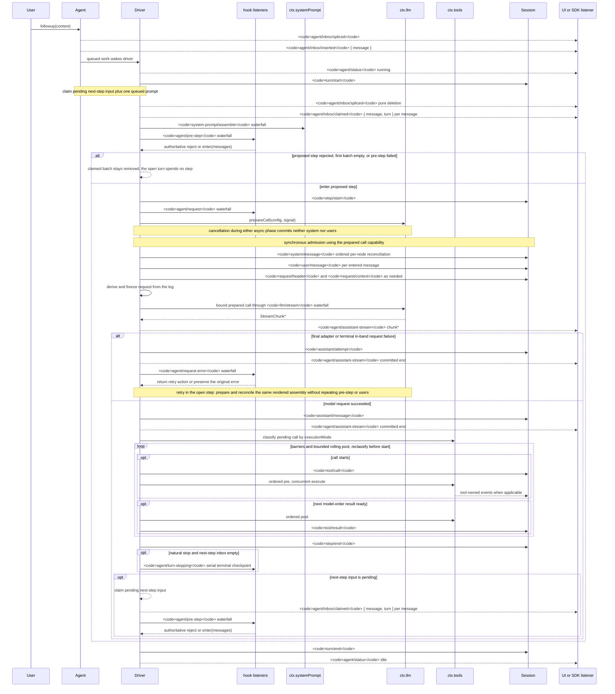

<!-- 英文源文件由 scripts/gen-doc-graphs.ts 生成；本中文文件是通過雙語配對維護的經評審對側。
     更新時先運行 `pnpm run gen-doc-graphs` 更新英文，再更新本文件并運行 `pnpm run verify-translation-pairing --write docs/agent-lifecycle.md` 重新記錄配對。 -->

# Agent 輪次與步驟生命周期

[English](agent-lifecycle.md) | 中文

此時序圖是 [architecture.md](architecture.zh.md#turn-flow) 的配套圖示。持久的回放事實保存在 `session/event` 中，實時控制與狀態則保存在 `agent/*` 中。

`assistant/message` 事件會記錄每次成功的提供方調用，包括返回空內容或以 `max-tokens` 結束的調用，并嵌入精確的緊湊帶時間 stream。空內容不會進入派生歷史。失敗、重試、取消或 stream error attempt 到達 settlement 時，如果沒有 surface message，就會把 stream 記錄為 `assistant/attempt`。實時 `agent/assistant-stream` chunk frame 是瞬態數據；回放讀取任一種持久 settlement，如果進程在 settlement 前硬中斷，則不會留下持久 attempt stream。

`dsh-compaction-basic` 在派生請求之前通過 `agent/pre-step` 處理壓力，而 `agent/request-error` 僅用于規范的上下文溢出。任一觸發條件滿足后，系統都會先執行可選的工具結果剪枝，再選擇摘要。恢復發生在仍打開的步驟內，只有剪枝或摘要生成推進 surface replacement generation 時才重試，否則仍以原始請求錯誤為準。每次重試都會準備調用，并在派生請求之前協調保留的已渲染組裝結果，不重復組裝、pre-step 或用戶消息準入。

以返回的 `agent/pre-step` 決策為準；通過包裝 `next()` 的監聽器會保留下游消息與 `startsRequestSeries`，除非有意替換。steering（中途引導）和注入的上下文在后續的認領操作取得其下一步驟批次后，會經過同一 waterfall（瀑布式事件）。

需要可回放 transcript（文本記錄）數據的 SDK 用戶應當消費 `session/event`；`agent/*` 是用于隊列與狀態、提示詞攔截、請求構造、steering、繼續執行和錯誤處理的實時協調接口。

維護模式：英文源文件包含人工維護的 Mermaid 時序圖，并由生成器寫出；本中文文件作為經評審對側通過雙語配對維護。確切的事件簽名位于生成的 Cordis 目錄中。
