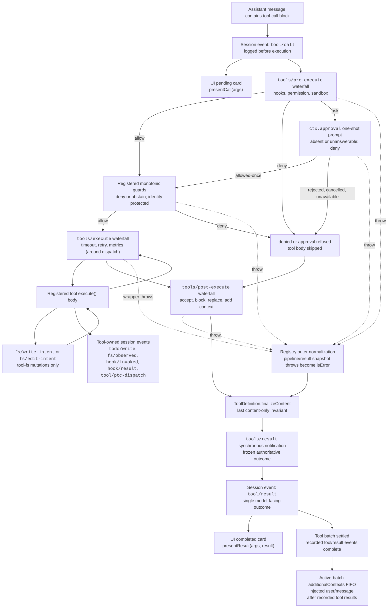

<!-- 英文源文件由 scripts/gen-doc-graphs.ts 生成；本中文文件是通過雙語配對維護的經評審對側。
     更新時先運行 `pnpm run gen-doc-graphs` 更新英文，再更新本文件并運行 `pnpm run verify-translation-pairing --write docs/tool-execution-pipeline.md` 重新記錄配對。 -->

# 工具執行流水線

[English](tool-execution-pipeline.md) | 中文

此圖展示策略、鉤子、沙箱、文件系統守衛、結果重寫、最終結果觀察和 UI 渲染在不改變循環的情況下何時運行。`tools/pre-execute` waterfall（瀑布式事件）首先運行，隨后是單調守衛，然后運行 `tools/execute` 和 `tools/post-execute` waterfall；這三個 waterfall 可以改寫一次調用。由定義自身控制的 `finalizeContent` 和 `tools/result` 在此之后運行。

文件系統的先讀后編輯檢查位于 `tool-fs` 之下，通過 `fs/*` 事件實現。通用的前置／后置 waterfall 承載鉤子與審批策略；`ctx.approval` 在單調守衛之前處理詢問，而不得重新排序的所有者策略仍作為已注冊的守衛。超時等環繞分發關注點對 `tools/execute` 進行包裝。注冊表會對候選結果進行無損快照；如果快照失敗，則會先將失敗規范化，之后再由可見定義中已隨快照固定的 `finalizeContent` 回調強制執行其同步且僅限內容的不變式。隨后，`tools/result` 會觀察不可變、可由 JSON 無損表示的結果。這樣一來，鉤子便可跨越不同工具系列，而無需讓工具與某個策略服務耦合。PTC mode 會將保留的 `run_code` 傳輸及其序列化子調用都送入流水線；子調用攜帶父級 token、記錄 `tool/ptc-dispatch`、將拒絕呈現為具有約束力的駁回，并省略 `additionalContexts`，以保持調用與結果相鄰。

維護模式：英文源文件包含人工維護的 Mermaid 流程圖，并由生成器寫出；本中文文件作為經評審對側通過雙語配對維護。確切的工具 schema 與事件簽名位于生成的目錄中。
